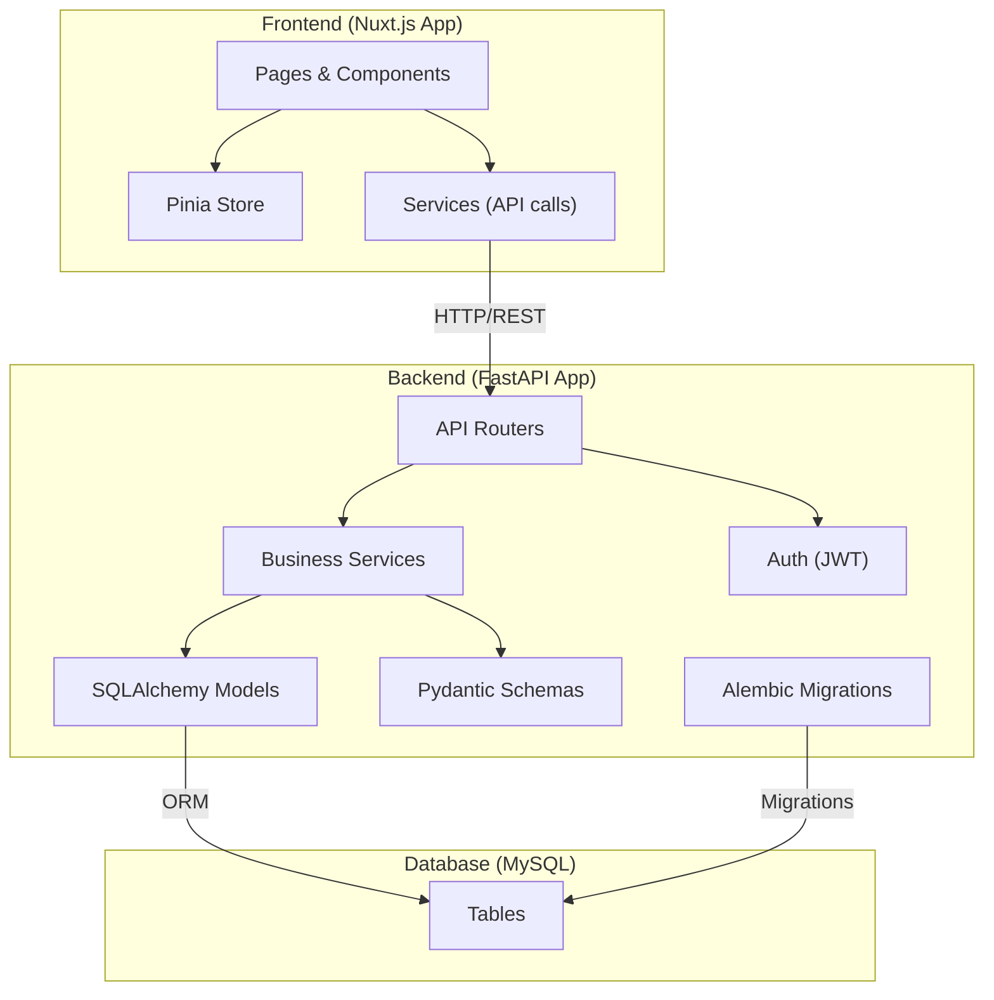

# Arquitectura del Sistema - Trans Comarapa

## Vista General

El sistema Trans Comarapa está basado en una arquitectura en capas, compuesta por:

- **Frontend:** Aplicación web desarrollada con Nuxt.js (Vue.js), que consume la API REST del backend.
- **Backend:** API RESTful construida con FastAPI (Python), que gestiona la lógica de negocio, autenticación/autorización y acceso a datos.
- **Base de Datos:** MySQL, gestionada mediante SQLAlchemy y migraciones con Alembic.

## Componentes Principales

### Frontend (Nuxt.js)
- Páginas y componentes Vue.
- Gestión de estado con Pinia.
- Comunicación con backend vía servicios (fetch/axios).
- Autenticación basada en JWT.
- Tailwind CSS para estilos.

### Backend (FastAPI)
- **Rutas (Endpoints):** Organizadas por dominio (usuarios, boletos, viajes, etc.).
- **Modelos:** SQLAlchemy para persistencia, Pydantic para validación.
- **Servicios:** Lógica de negocio separada de las rutas.
- **Autenticación:** JWT, roles y permisos.
- **Migraciones:** Alembic.
- **Documentación:** OpenAPI/Swagger generada automáticamente.

### Base de Datos (MySQL)
- **Descripción:** Almacena todos los datos persistentes de la aplicación, como usuarios, boletos, rutas, etc.
- **Tecnología:** MySQL.
- **Interacción:** El backend interactúa con la base de datos a través de SQLAlchemy (ORM). Alembic se utiliza para gestionar las migraciones del esquema de la base de datos.

## Diagrama de Componentes

El siguiente diagrama muestra la interacción entre los principales componentes del sistema:

## Otros Aspectos Clave

- **Docker:** Para desarrollo y despliegue consistente.
- **CI/CD:** Automatización de tests y despliegues.
- **Testing:** Pytest para backend, Vitest/Jest para frontend.
- **Documentación:** Centralizada en `/docs`.

---