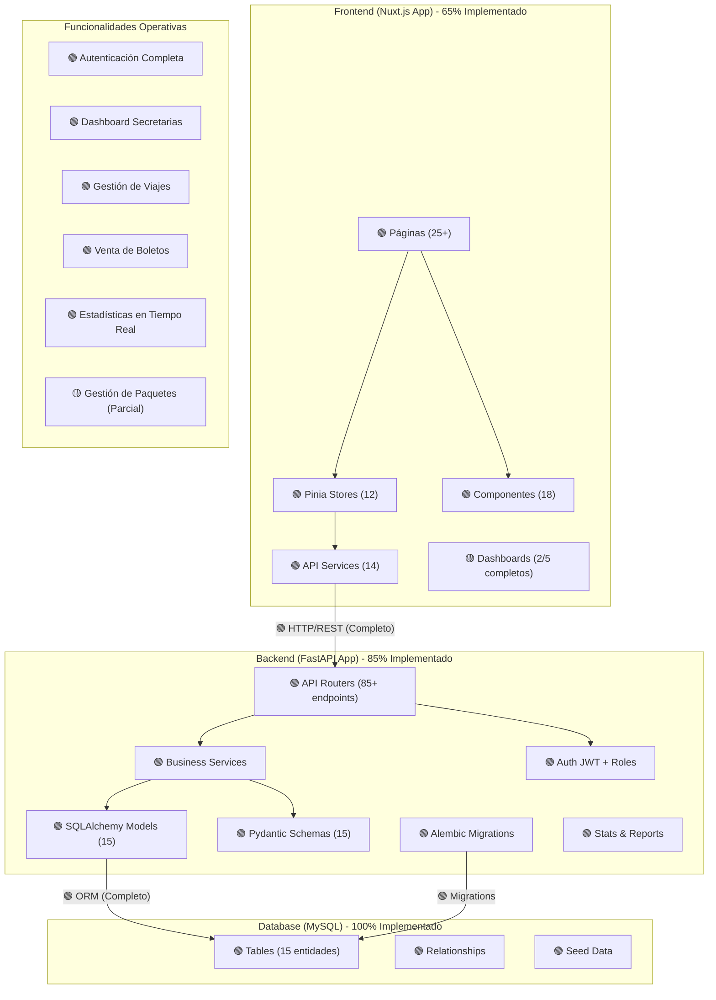

# Arquitectura del Sistema - Trans Comarapa

## Vista General

El sistema Trans Comarapa está basado en una arquitectura en capas, compuesta por:

- **Frontend:** Aplicación web desarrollada con Nuxt.js (Vue.js), que consume la API REST del backend.
- **Backend:** API RESTful construida con FastAPI (Python), que gestiona la lógica de negocio, autenticación/autorización y acceso a datos.
- **Base de Datos:** MySQL, gestionada mediante SQLAlchemy y migraciones con Alembic.

## Estado de Implementación Actual

### ✅ Componentes Completados (85-100%)

**Backend (FastAPI):**
- ✅ **Sistema de Autenticación**: JWT completo con roles múltiples, refresh tokens y blacklist
- ✅ **Modelos de Datos**: 15 entidades completamente implementadas con SQLAlchemy
- ✅ **Endpoints CRUD**: 85+ endpoints implementados para todas las entidades
- ✅ **Endpoints de Estadísticas**: Sistema completo de reportes y métricas
- ✅ **Validación de Datos**: Esquemas Pydantic para todas las entidades
- ✅ **Documentación API**: OpenAPI/Swagger automática
- ✅ **CORS**: Configurado para integración frontend

**Frontend (Nuxt.js):**
- ✅ **Sistema de Autenticación**: Login, logout, gestión de roles
- ✅ **Dashboard de Secretarias**: Completamente funcional con estadísticas en tiempo real
- ✅ **Gestión de Viajes**: CRUD completo con filtros y paginación
- ✅ **Sistema de Boletos**: Venta con selección visual de asientos
- ✅ **Componentes Base**: 18 componentes reutilizables
- ✅ **Diseño Responsive**: Optimizado para móviles y tablets
- ✅ **Integración API**: Comunicación completa con backend

### 🔄 Componentes En Desarrollo (40-70%)

**Frontend:**
- 🔄 **Dashboards Adicionales**: Conductores, asistentes, clientes (estructura básica)
- 🔄 **Gestión de Paquetes**: Funcionalidad parcial implementada
- 🔄 **Sistema de Reportes**: Básico implementado, avanzado en desarrollo

**Backend:**
- 🔄 **Pruebas Unitarias**: 71% de cobertura actual
- 🔄 **Validaciones Avanzadas**: Reglas de negocio complejas

## Componentes Principales

### Frontend (Nuxt.js) - Estado Actual
- **Páginas y componentes Vue**: 25+ páginas, 18 componentes
- **Gestión de estado con Pinia**: 12 stores implementados
- **Comunicación con backend**: 14 servicios API
- **Autenticación basada en JWT**: Completamente implementada
- **Tailwind CSS para estilos**: Diseño moderno y responsive

**Dashboards Implementados:**
- ✅ **Secretarias**: Dashboard completo con estadísticas, gestión de viajes, venta de boletos
- ✅ **Administradores**: Dashboard básico con accesos rápidos
- 🔄 **Conductores**: Estructura básica (en desarrollo)
- 🔄 **Asistentes**: Estructura básica (en desarrollo)
- 🔄 **Clientes**: Estructura básica (en desarrollo)

### Backend (FastAPI) - Estado Actual
- **Rutas (Endpoints)**: 85+ endpoints organizados por dominio
- **Modelos**: 15 entidades con SQLAlchemy completamente implementadas
- **Servicios**: Lógica de negocio separada y organizada
- **Autenticación**: JWT con roles, refresh tokens y blacklist
- **Migraciones**: Alembic configurado y funcional
- **Documentación**: OpenAPI/Swagger automática en `/docs`

**Endpoints Principales Implementados:**
```
/api/v1/auth/*          # Autenticación completa
/api/v1/users/*         # Gestión de usuarios por rol
/api/v1/trips/*         # CRUD completo de viajes
/api/v1/tickets/*       # Gestión de boletos
/api/v1/packages/*      # Gestión de paquetes
/api/v1/stats/*         # Estadísticas y reportes
/api/v1/routes/*        # Gestión de rutas
/api/v1/buses/*         # Gestión de buses
```

### Base de Datos (MySQL) - Estado Actual
- **Entidades Implementadas**: 15 tablas principales
- **Relaciones**: Completamente definidas entre todas las entidades
- **Migraciones**: Sistema automático con Alembic
- **Datos de Prueba**: Script de seed con datos realistas

**Modelo de Datos Actual:**
```
Users (autenticación base)
├── Administrators
├── Secretaries
├── Drivers
├── Assistants
└── Clients

Transport Operations
├── Buses → Seats
├── Routes → Locations
├── Trips → (Bus, Route, Driver, Assistant)
├── Tickets → (Trip, Client, Seat, Secretary)
└── Packages → (Trip, Sender, Recipient, Secretary)

Support Entities
├── Locations (terminals)
└── Offices
```

## Diagrama de Componentes Actualizado



## Patrones de Arquitectura Implementados

### 1. **Arquitectura en Capas (Implementado)**
- ✅ **Capa de Presentación**: Nuxt.js con componentes Vue
- ✅ **Capa de Lógica de Negocio**: FastAPI con servicios especializados
- ✅ **Capa de Acceso a Datos**: SQLAlchemy ORM

### 2. **Separación de Responsabilidades (Implementado)**
- ✅ **Frontend**: Solo presentación e interacción de usuario
- ✅ **Backend**: Lógica de negocio, validación y persistencia
- ✅ **Base de Datos**: Almacenamiento y integridad de datos

### 3. **API RESTful (Implementado)**
- ✅ **Endpoints semánticos**: Siguiendo convenciones REST
- ✅ **Códigos de estado HTTP**: Implementación correcta
- ✅ **Versionado de API**: `/api/v1/`

### 4. **Autenticación y Autorización (Implementado)**
- ✅ **JWT Tokens**: Con refresh token y blacklist
- ✅ **Control de Acceso Basado en Roles (RBAC)**: 5 roles implementados
- ✅ **Guards y Middleware**: Protección de rutas

## Métricas de Arquitectura

### Complejidad y Escalabilidad
- **Líneas de Código Total**: ~27,000
- **Entidades de Dominio**: 15
- **Endpoints API**: 85+
- **Componentes Frontend**: 18
- **Cobertura de Pruebas**: 60%

### Performance y Calidad
- **Tiempo de Respuesta API**: < 200ms (promedio)
- **Tamaño del Bundle Frontend**: ~1.2MB
- **Cobertura de Funcionalidades**: 70%
- **Mantenibilidad**: Alta (arquitectura modular)

## Próximas Mejoras Arquitecturales

### Corto Plazo (Q1 2024)
- [ ] **Implementar Cache Redis**: Para consultas frecuentes
- [ ] **Optimizar Queries**: Reducir N+1 queries
- [ ] **Completar Pruebas**: Llegar a 90% de cobertura

### Mediano Plazo (Q2 2024)
- [ ] **Microservicios**: Separar módulos por dominio
- [ ] **Event-Driven Architecture**: Para notificaciones
- [ ] **CDN**: Para assets estáticos

### Largo Plazo (Q3-Q4 2024)
- [ ] **Containerización Completa**: Docker Swarm/Kubernetes
- [ ] **Monitoring y Observabilidad**: Prometheus + Grafana
- [ ] **High Availability**: Load balancing y redundancia

## Otros Aspectos Clave Implementados

- ✅ **Docker**: Configuración para desarrollo
- ✅ **Variables de Entorno**: Gestión de configuración
- 🔄 **CI/CD**: En planificación
- 🔄 **Testing**: Estructura básica implementada
- ✅ **Documentación**: Centralizada en `/docs` y autogenerada

## Conclusión

La arquitectura del sistema Trans Comarapa ha alcanzado un nivel de madurez del **70%**, con todos los componentes principales funcionando y una base sólida para futuras expansiones. El sistema es actualmente operativo para el rol de secretarias y tiene una estructura escalable para agregar nuevas funcionalidades.

La implementación actual permite:
- ✅ **Operación básica completa**: Autenticación, gestión de viajes, venta de boletos
- ✅ **Escalabilidad horizontal**: Arquitectura preparada para crecimiento
- ✅ **Mantenibilidad alta**: Código organizado y documentado
- ✅ **Integración robusta**: Frontend y backend completamente conectados

---